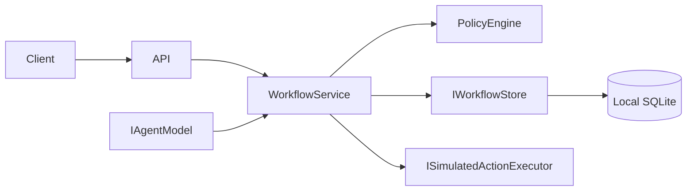
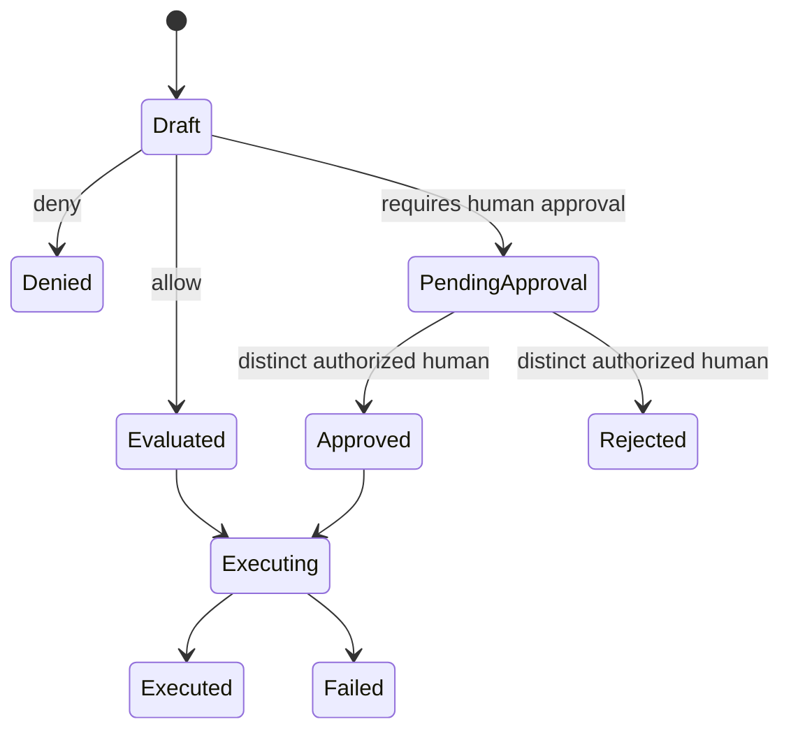

# Architecture

Human Loop Lab is one local ASP.NET Core application, not a set of microservices. Domain contains the action catalog and explicit proposal state machine. Application owns workflow/policy/advice and ports. Infrastructure implements those ports with EF Core SQLite, fixed actors, a deterministic agent and safe simulators. API owns HTTP DTOs, Problem Details, Swagger and composition.

## Request lifecycle

A proposer chooses an action and target. The action catalog supplies required scope, risk, reversibility and approval requirement. Policy checks actor scope, blocks agent self-authorization, and requires a distinct human for high risk. An approval records the specific action, target and scope it covers, plus expiry. Execution checks the persisted decision and approval again. The simulator never touches the named target.

The fixed `X-Demo-Actor-Id` header is an **identity selector for a local demo**, not authentication. Authorization is still evaluated independently in the application layer. In a real service the authenticated principal would be mapped to a trusted actor and scopes, and policy/configuration would be protected separately from both the model and callers. The agent adapter can suggest work but cannot decide its own policy outcome or approve itself.

## Audit and responsibility

Each meaningful state transition appends an audit event with a correlation ID, proposal ID, actor ID, UTC timestamp, event type, and structured metadata. It deliberately omits secrets and proposal evidence. The responsibility endpoint composes proposer, policy outcome, human approver, executor, resource and final result. These records support reconstruction; they do not settle moral accountability.

## Idempotency and limits

The execution request requires a key. A unique SQLite key links one proposal to one execution record. A repeated key for that proposal returns the stored result and appends `DuplicateExecutionSuppressed`; reuse on another proposal is a conflict. A process-local semaphore serializes the demo's execution path. The simulator records `ExecutionStarted` before producing a result. After an interruption, an in-progress key fails closed rather than risking a second execution.

This is suitable for a single-process local lab, not distributed exactly-once execution. A production replacement needs a transactional claim/outbox, cross-instance coordination, tool-specific idempotency, durable recovery, and explicit policies for partial failures. SQLite migration is applied automatically on startup only to the lab database.

## Model provider boundary

`IAgentModel` produces a deterministic suggestion in the default build. A real provider adapter can replace it without changing `PolicyEngine`, `WorkflowService`, or the executor gate. Model output remains untrusted input and is validated at the API/application boundary. [Provider guide](adding-an-ai-provider.md).
